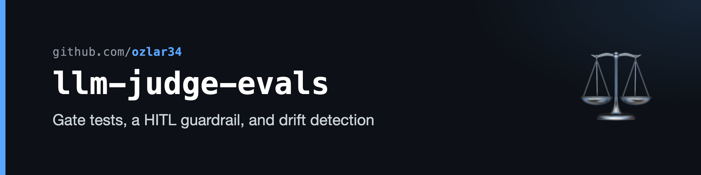

# llm-judge-evals

A small, dependency-free harness for keeping an **LLM-as-judge** honest: gate tests on documented mis-scores, a human-in-the-loop guardrail, and an append-only drift log that catches a prompt edit silently breaking a gate.

LLM judges drift and mis-fire. The judge under test here once rated a job listing **10/10 that explicitly required fluent German** — a hard disqualifier the model saw in the text and scored right past. This repo is the harness that turns that failure (and ten others) into regression cases, then proves the hardened prompt fixes them.

It's a **worked example, not a library** — the value is in the *shape* of the evaluation, not the specific rubric. The rubric under test is a frozen, anonymized snapshot of the job-scoring prompt from [`job-match-radar`](https://github.com/ozlar34/job-match-radar); the eval pattern transfers to any LLM judge that emits a score + rationale.

## The three mechanisms

| | What it does | Why it exists |
|---|---|---|
| **Gate eval** | Replays / re-scores 11 calibration cases — each a real documented mis-score — and checks whether the hard cap that *should* fire actually does (`PASS` / `FAIL` / `GAP`). | A judge that ignores a hard reject is the failure mode. Each case pins one gate. |
| **Guardrail (HITL)** | Independent of pass/fail, routes self-contradicting or low-confidence outputs to a human-review queue: a cap-level score that names no disqualifier, a strong score whose rationale names a hard reject, the borderline 5–6 band. | Mirrors the human review ritual the cases came from. Catches the *Case A-10* mode: a 9/10 whose own rationale admits a hard reject. |
| **Drift log** | Append-only, keyed to the rubric version (sync tag + prompt sha). Flags a `PASS→FAIL` regression across same-judge runs. | A prompt edit can silently regress a gate. The log catches it across runs, not at the next manual review. |

## Quick start

No dependencies, no API key, runs anywhere with Python 3.8+:

```bash
python3 eval.py                  # the documented "before" table (replay judge, offline)
python3 eval.py --drift          # score trajectory across recorded runs + regression alerts
python3 test_guardrail.py        # unit tests: each guardrail flag fires when it should, stays quiet when it shouldn't
```

The shipped drift log records both halves of the story against the current rubric: **replay (before) `0/11` gates fired → live Claude judge (after) `11/11` fired, 0 regressions.**

<details>
<summary>Example output (replay judge — the documented "before" state)</summary>

```
STATUS REVIEW CASE                       TYPE  RULE  CAP SCORE  GATE (expected)
-------------------------------------------------------------------------------
FAIL          company-a-tech-pm          hard  impl    2    10  Q2 non-English fluency (German required)
FAIL   HOLD   company-b-organized-play   hard  impl    2     6  Q2 non-English fluency (Italian/Portuguese …
FAIL   HOLD   company-c-community-mgr    hard  impl    2     6  Q5 posted comp below the 80k floor
FAIL          company-d-community-iberia hard  impl    4     7  Territory-named market title outside DACH/E…
...
0/11 gates fired as expected.
Human-review queue: 4/11 output(s) routed to a human (the guardrail gate).
```
</details>

## The three judges

The judge is pluggable — `--judge` selects how each case is scored:

- **`replay`** (default) — replays the score the model historically gave, straight from the calibration log. No model needed; prints the documented "before" table offline. (No rationale is archived, so rationale-based guardrail checks are skipped.)
- **`claude`** — re-runs the *current* prompt live via the headless Claude CLI (`claude -p`, no API key). The "after" / hardened-prompt path; captures the rationale so the guardrail can inspect it.
- **`ollama`** — same, against a local Ollama model (`--ollama-model`, `--ollama-host`).

```bash
python3 eval.py --judge claude --record   # score the current prompt live, append to the drift log
python3 eval.py --judge ollama --ollama-model gemma3:4b
```

## Architecture


<details>
<summary>Text version</summary>

```
┌──────────────────────────────┐   ┌──────────────────────────────┐
│ scoring-prompt.snapshot.md   │   │ cases.json                   │
│ frozen rubric under test     │   │ 11 documented mis-scores     │
└──────────────────────────────┘   └──────────────────────────────┘
                 └───────────────┬───────────────┘
                                 ▼
                   ┌──────────────────────────┐
                   │ judge: replay | claude    │
                   │ | ollama → {score, ratio} │
                   └──────────────────────────┘
                                 ▼
        ┌────────────────────────┐   ┌────────────────────────────┐
        │ Gate eval              │   │ Guardrail (HITL)            │
        │ score ≤ cap?           │   │ self-contradiction / band   │
        │ PASS / FAIL / GAP      │   │ → human-review queue        │
        └────────────────────────┘   └────────────────────────────┘
                                 ▼
                   ┌──────────────────────────┐
                   │ drift-log.jsonl (--record)│
                   │ keyed to rubric version   │
                   │ → PASS→FAIL alerts (--drift)
                   └──────────────────────────┘
```
</details>

## What's in here

```
eval.py                            the harness: judges, gate eval, guardrail, drift log
test_guardrail.py                  negative-control unit tests for the guardrail
fixtures/
  scoring-prompt.snapshot.md       the frozen, anonymized rubric under test
  cases.json                       11 calibration cases (documented mis-scores)
drift-log.jsonl                    shipped before/after run history
```

## A note on the data

The 11 cases are real, human-corrected mis-scores from the source system's calibration log. **Company identities are anonymized placeholders (`Company A`–`J`)** and the rubric's candidate profile has been redacted to a generic target — the gate logic, trigger phrases, and calibration history are otherwise preserved. The case fixtures' job descriptions are minimal stand-ins carrying the exact trigger phrase each gate keys on; the original full listings are not archived.

## License

MIT. See [`LICENSE`](LICENSE).
